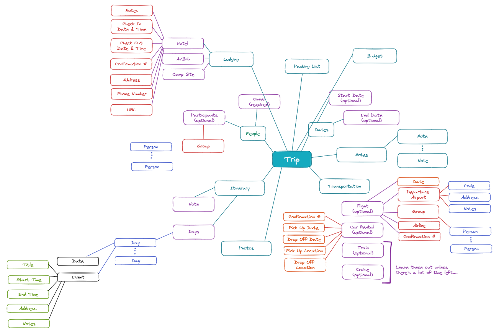

# vacation.io

A vacation planning tool where you can organize all of your trip details in one location!

## MVP Features
* User sign up
* User sign in
* Display user's trips (trip name, photo, date range)

## Stretch Goals
* Allowing user to update the dates of a trip
* Allowing user to delete a trip
* Implementing wizard to allow a user to create a trip
* Letting a user specify the following details for a trip:
  * Notes
  * Transportation (flight and/or car rental)
  * Packing list
  * Lodging (hotel, Airbnb)
  * Itinerary
* Integrating with ChatGPT API as a travel planning assistant
* Integrating with Google Maps

## Technologies
* PostgreSQL 
* Express
* React
* Node

## Planning
